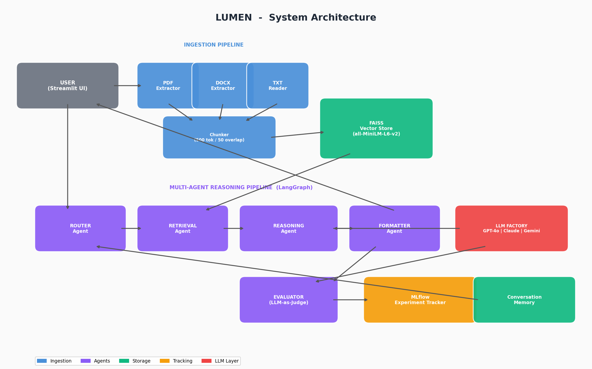

# 🔆 Lumen

**Ask anything. Get answers from your documents — not the internet.**

[](https://www.python.org/downloads/)
[](LICENSE)
[](https://streamlit.io)
[]()

---


> **See it live:** [Streamlit Cloud link — coming soon]

---

## The Problem

Knowledge workers spend hours reading through documents to find answers that should take seconds. Existing RAG chatbots hallucinate freely, rarely cite their sources, and can't reason across multiple documents. There is no free, open-source tool that combines multi-document reasoning, contradiction detection, source citations, confidence scoring, and LLM-as-judge evaluation in a single system.

**Lumen fixes that.**

---

## Architecture



Lumen uses a **multi-agent pipeline** built with LangGraph. Each stage is a specialized agent that handles one part of the reasoning process — from query classification to retrieval, reasoning, formatting, and self-evaluation.

---

## Features

- **Multi-format ingestion** — Upload PDFs, DOCX, and TXT files with automatic text extraction and OCR fallback for scanned documents
- **Intelligent chunking** — 500-token chunks with 50-token overlap, preserving document metadata (filename, page number) throughout
- **Semantic search** — FAISS vector store with sentence-transformer embeddings (all-MiniLM-L6-v2), no API key needed for embeddings
- **Multi-agent reasoning** — LangGraph pipeline with specialized Router, Retrieval, Reasoning, Formatter, and Evaluator agents
- **5 query types** — Simple retrieval, cross-document comparison, contradiction detection, summarization, and confidence analysis
- **Source citations** — Every answer includes the exact document name and page numbers used
- **Confidence scoring** — 0–100 confidence score derived from retrieval similarity metrics
- **LLM-as-judge evaluation** — Automatic scoring on Faithfulness, Completeness, Clarity, and Hallucination Risk (1–5 each)
- **Multi-model support** — Switch between Gemini 2.5 Flash and Llama 3 70B (Groq) from a sidebar dropdown — both free, no API costs
- **Conversation memory** — Follow-up questions that reference previous answers
- **MLflow experiment tracking** — Every query logged with parameters, metrics, and artifacts for full observability
- **4 domain modules** — Pre-configured prompts and example questions for Finance, Healthcare, Legal, and HR/Talent
- **Graceful error handling** — Missing API keys disable individual models instead of crashing the app

---

## Tech Stack

| Component | Technology |
|---|---|
| Frontend | Streamlit |
| Orchestration | LangGraph (multi-agent pipeline) |
| Embeddings | sentence-transformers (all-MiniLM-L6-v2) |
| Vector Store | FAISS (local, CPU) |
| LLMs | Google Gemini 2.5 Flash, Meta Llama 3 70B (via Groq) |
| PDF Extraction | PyMuPDF + pytesseract (OCR fallback) |
| DOCX Extraction | python-docx |
| Experiment Tracking | MLflow |
| Memory | LangChain ConversationBufferMemory |
| Testing | pytest |

---

## Quick Start

### 1. Clone the repository

```bash
git clone https://github.com/your-username/lumen.git
cd lumen
```

### 2. Create a virtual environment

```bash
python -m venv venv
source venv/bin/activate   # On Windows: venv\Scripts\activate
```

### 3. Install dependencies

```bash
pip install -r requirements.txt
```

### 4. Set up API keys

```bash
cp .env.example .env
# Edit .env and add your API keys (you only need keys for models you want to use)
```

### 5. Generate the architecture diagram

```bash
python generate_architecture.py
```

### 6. Run Lumen

```bash
streamlit run app.py
```

### 7. (Optional) Launch MLflow UI

```bash
mlflow ui --backend-store-uri mlruns
# Open http://localhost:5000 in your browser
```

---

## Domain Modules

| Domain | Icon | Focus Area | Example Question |
|---|---|---|---|
| Finance | 💰 | SEC filings, earnings reports | "Compare the gross margins across these earnings reports." |
| Healthcare | 🏥 | Clinical notes, medical literature | "What treatment protocols are recommended in these guidelines?" |
| Legal | ⚖️ | Contracts, policy documents | "Are there contradictions between the NDA and the MSA?" |
| HR & Talent | 👥 | Job descriptions, resumes | "What are the required qualifications for this role?" |

Select a domain from the sidebar to load specialized system prompts and example questions. You can still upload your own documents on top of any domain.

---

## MLflow Tracking

Every query is logged as an MLflow run with:

- **Parameters:** query text, query type, model used, chunk count
- **Metrics:** latency (ms), confidence score, faithfulness, completeness, clarity, hallucination risk, overall eval score
- **Artifacts:** full LLM prompt and response text

The sidebar shows a live metrics summary. Launch `mlflow ui` for the full experiment dashboard.


---

## Project Structure

```
lumen/
├── app.py                          # Main Streamlit app
├── requirements.txt                # All dependencies with versions
├── .env.example                    # Template for API keys
├── README.md                       # This file
├── architecture.png                # Architecture diagram
├── generate_architecture.py        # Script to generate the diagram
│
├── core/
│   ├── __init__.py
│   ├── ingestion.py                # Document loading, chunking, metadata extraction
│   ├── embeddings.py               # Sentence transformer embeddings
│   ├── vector_store.py             # FAISS operations (add, search, clear)
│   ├── memory.py                   # Conversation memory management
│   └── config.py                   # All configuration constants
│
├── agents/
│   ├── __init__.py
│   ├── router.py                   # Query classification agent
│   ├── retrieval.py                # FAISS retrieval agent
│   ├── reasoning.py                # Multi-document reasoning agent
│   ├── formatter.py                # Response formatting agent
│   ├── evaluator.py                # LLM-as-judge evaluation agent
│   └── graph.py                    # Pipeline connecting all agents
│
├── models/
│   ├── __init__.py
│   └── llm_factory.py             # Factory pattern for LLM initialization
│
├── tracking/
│   ├── __init__.py
│   └── mlflow_logger.py           # MLflow logging functions
│
├── domains/
│   ├── finance/                    # Finance domain config + sample docs
│   ├── healthcare/                 # Healthcare domain config + sample docs
│   ├── legal/                      # Legal domain config + sample docs
│   └── hr_tech/                    # HR/Talent domain config + sample docs
│
└── tests/
    ├── test_ingestion.py           # Ingestion pipeline tests
    ├── test_retrieval.py           # Vector store & retrieval tests
    └── test_agents.py             # Agent module tests
```

---

## How It Works

1. **Upload** — The user uploads one or more documents (PDF, DOCX, TXT) through the Streamlit sidebar.

2. **Ingest** — Each document is processed by the ingestion pipeline: text is extracted (with OCR fallback for scanned PDFs), then split into 500-token chunks with 50-token overlap. Every chunk retains its source filename and page number.

3. **Embed & Index** — Chunks are embedded using the all-MiniLM-L6-v2 sentence transformer and stored in a FAISS vector index for fast similarity search.

4. **Query** — When the user asks a question, the **Router Agent** classifies it into one of five types: simple retrieval, comparison, contradiction check, summarization, or confidence check.

5. **Retrieve** — The **Retrieval Agent** fetches the top-k most relevant chunks from FAISS, adjusting k based on query complexity (5 for simple, 8 for comparisons, 10 for summaries).

6. **Reason** — The **Reasoning Agent** generates an answer using the selected LLM (Gemini 2.5 Flash or Llama 3 70B via Groq), with a query-type-specific system prompt and the retrieved context.

7. **Evaluate** — The **Evaluator Agent** uses LLM-as-judge to score the response on Faithfulness, Completeness, Clarity, and Hallucination Risk.

8. **Format & Display** — The **Formatter Agent** packages everything — answer, sources, confidence score, eval scorecard, latency — and the Streamlit UI renders it.

9. **Track** — Every query is logged to MLflow with full parameters, metrics, and artifacts for experiment analysis.

---

## Future Improvements

- **Hybrid search** — Combine dense vector search with BM25 sparse retrieval for better recall
- **Streaming responses** — Stream LLM output token-by-token for faster perceived latency
- **Document-level summaries** — Auto-generate summaries on upload for faster orientation
- **Multi-modal support** — Process tables, charts, and images within documents using vision models
- **Deployment** — Dockerize the full stack and deploy to AWS/GCP with CI/CD

---

## Author

**Rahul Roy**
- [LinkedIn](https://linkedin.com/in/your-profile)

---

## License

This project is licensed under the MIT License.
